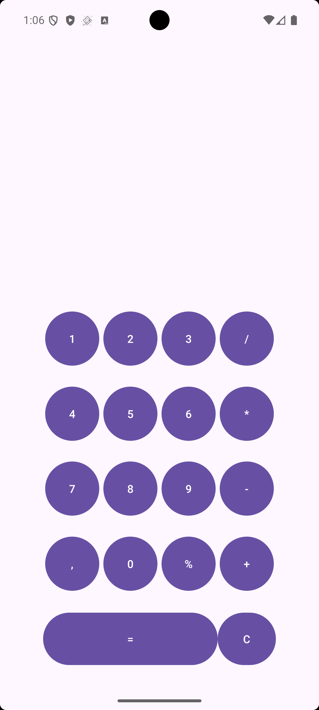

# Android Calculator App

Bu proje, **Java** dili kullanılarak **Android Studio** ortamında geliştirilmiş basit ve işlevsel bir hesap makinesi uygulamasıdır.  
Android kullanıcı arayüzü yönetimi ve temel aritmetik işlemlerin uygulanmasını göstermeyi amaçlamaktadır.

---

## 📱 Uygulama Özellikleri

- Toplama (+)
- Çıkarma (−)
- Çarpma (×)
- Bölme (÷)
- Mod alma (%)
- Temizleme (C) butonu
- Ondalıklı sayı desteği
- Basit ve sade kullanıcı arayüzü
- Tek Activity yapısı

---

## 🛠️ Kullanılan Teknolojiler

- Java
- Android Studio
- XML (UI tasarımı)

---

## 📸 Ekran Görüntüsü

---

## 📂 Proje Yapısı

